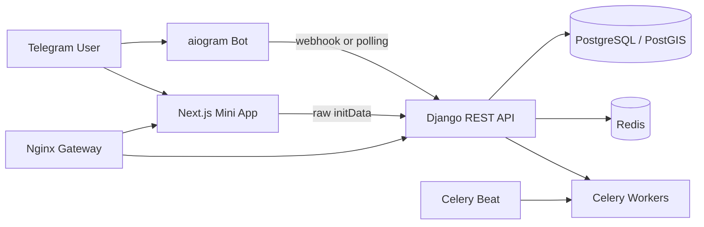

# FlatHunter AI

**FlatHunter AI — розумний пошук житла**: Telegram-бот і Mini App, які мають перетворити пошук довгострокової оренди в Україні на автоматизований, персоналізований процес.

> Поточний стан: **Етап 1 — Foundation**. Репозиторій уже містить production-oriented monorepo, Django API, захищену Telegram Mini App авторизацію, Telegram-бота, Next.js Mini App, PostgreSQL/PostGIS, Redis, Celery, health checks, Docker Compose та CI.

## Що реалізовано на етапі 1

- monorepo з окремими `backend`, `miniapp`, `infrastructure` і `docs`;
- Django 6 + Django REST Framework API;
- кастомна UUID-модель користувача та ролі;
- Telegram-профіль із 64-бітним Telegram ID;
- валідація оригінального Telegram `initData` на backend;
- перевірка HMAC, `auth_date`, підмінених полів і replay protection;
- короткострокова серверна сесія через Secure/HttpOnly cookie;
- aiogram-бот із `/start`, inline-кнопками та Mini App URL;
- взаємовиключні режими `polling` і `webhook`;
- webhook secret header та захист від повторної обробки `update_id`;
- адаптивний Next.js Mini App із UA/EN, Telegram theme params, safe-area та offline/degraded станами;
- PostgreSQL/PostGIS, Redis, Celery worker і Celery Beat;
- liveness/readiness/API health endpoints;
- JSON-логування, request ID та безпечні API-помилки;
- Docker Compose, Nginx gateway і GitHub Actions;
- unit/API integration tests для критичної Telegram-безпеки.

## Архітектура



Детальніше: [`docs/architecture.md`](docs/architecture.md).

## Швидкий запуск через Docker

1. Створіть локальне оточення:

```bash
cp .env.example .env
```

2. Додайте `TELEGRAM_BOT_TOKEN`, `TELEGRAM_BOT_USERNAME` і `TELEGRAM_MINI_APP_URL` у `.env`.

3. Запустіть web stack:

```bash
docker compose up --build -d
```

4. Для локального long polling окремо активуйте профіль бота:

```bash
docker compose --profile polling up --build -d
```

Mini App: `http://localhost:8080`  
API docs: `http://localhost:8080/api/docs/`  
Liveness: `http://localhost:8080/health/live/`  
Readiness: `http://localhost:8080/health/ready/`

## Локальний запуск без Docker

### Backend

```bash
cd backend
uv venv
uv pip install --python .venv/bin/python --requirement requirements-dev.lock
uv run --no-sync python manage.py migrate
uv run --no-sync python manage.py runserver
```

За відсутності `DATABASE_URL` і `REDIS_URL` локальна розробка використовує SQLite та in-memory cache. Production і Docker використовують PostgreSQL/PostGIS та Redis.

### Mini App

```bash
cd miniapp
npm install --ignore-scripts
npm run dev
```

Відкрийте `http://localhost:3000`. Браузерний режим навмисно **не обходить Telegram-вхід**: він показує безпечний UI preview. Реальний користувач створюється лише після успішної серверної перевірки Telegram `initData`.

### Telegram bot

```bash
cd backend
TELEGRAM_MODE=polling uv run --no-sync python manage.py runbot
```

`runbot` відмовиться запускатися, якщо `TELEGRAM_MODE` не дорівнює `polling`. У production використовується webhook, тому polling-контейнер не запускається.

## Перевірки

```bash
make check
```

Окремо:

```bash
cd backend
uv run --no-sync ruff format --check apps config tests manage.py
uv run --no-sync ruff check apps config tests manage.py
uv run --no-sync mypy apps config
uv run --no-sync pytest

cd ../miniapp
npm run lint
npm run typecheck
npm test
npm run build
```

## Telegram webhook

Production webhook має використовувати HTTPS і секретний заголовок. Endpoint:

```text
POST /api/v1/telegram/webhook/
```

Статус конфігурації без секретів:

```text
GET /api/v1/telegram/status/
```

Приклад реєстрації webhook наведений у [`docs/deployment.md`](docs/deployment.md).

## Environment variables

Повний перелік знаходиться у [`.env.example`](.env.example). Реальні джерела оголошень вимкнені за замовчуванням. Жодних bot token, API key або cookie не можна комітити в репозиторій.

## Документація

- [`docs/architecture.md`](docs/architecture.md) — межі компонентів і data flow;
- [`docs/api.md`](docs/api.md) — endpoints етапу 1;
- [`docs/bot-flows.md`](docs/bot-flows.md) — `/start`, Mini App і webhook;
- [`docs/data-sources.md`](docs/data-sources.md) — legal-first правила адаптерів;
- [`docs/security.md`](docs/security.md) — Telegram auth, cookies, logging і threat boundaries;
- [`docs/deployment.md`](docs/deployment.md) — локальний і production запуск;
- [`docs/demo.md`](docs/demo.md) — поточний browser preview і план demo pipeline.

## Наступний етап

Етап 2 додасть onboarding, `SearchProfile`, структуровані фільтри, налаштування сповіщень та природномовне створення пошуку через абстракцію AI provider.

## Legal notice

FlatHunter AI не містить механізмів обходу CAPTCHA, авторизації, rate limits, fingerprinting або приватних API. Реальні джерела можуть підключатися лише після перевірки умов доступу. До цього продукт працюватиме на synthetic demo data, ручному імпорті та офіційно дозволених інтеграціях.
