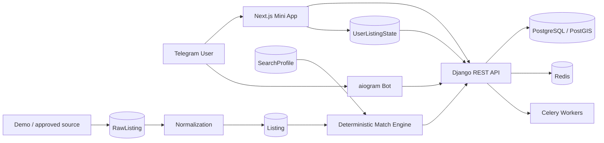

# FlatHunter AI

**FlatHunter AI — розумний пошук житла**: Telegram-бот і Mini App для автоматизованого персоналізованого пошуку довгострокової оренди в Україні.

> Поточний стан: **Етап 5 — Mini App UI**. Система має production-oriented основу, Telegram onboarding, synthetic demo pipeline, deterministic Match Score і повноцінний мобільний кабінет користувача.

## Реалізовано

- Django 6 + Django REST Framework;
- Next.js Telegram Mini App з Telegram theme, safe-area та offline states;
- Telegram auth через перевірений `initData` і HttpOnly session;
- aiogram bot із `/start`, Mini App та FSM onboarding;
- `SearchProfile`, важливі точки й правила сповіщень;
- природномовний fallback parser без обов'язкового AI API;
- `ListingSource`, `RawListing`, `Listing` і `UserListingState`;
- legal-first adapter interface та deterministic demo source;
- стійкий ідемпотентний ingestion pipeline;
- 150 synthetic demo listings;
- deterministic Match Score із шістьма компонентами та поясненнями;
- dashboard із персональними лічильниками;
- персональна стрічка, деталі квартири, розширені фільтри;
- обране, приховування та порівняння до чотирьох квартир;
- user-scoped state API з ownership-захистом;
- loading, empty, authentication, validation і error states;
- PostgreSQL/PostGIS, Redis, Celery, Docker Compose, Nginx і CI;
- Ruff, mypy, pytest, ESLint, TypeScript, audits, Docker builds і Gitleaks.

## Архітектура



Детальніше: [`docs/architecture.md`](docs/architecture.md), [`docs/stage-3-demo-pipeline.md`](docs/stage-3-demo-pipeline.md), [`docs/stage-4-matching.md`](docs/stage-4-matching.md) і [`docs/stage-5-miniapp-ui.md`](docs/stage-5-miniapp-ui.md).

## Запуск через Docker

```bash
cp .env.example .env
docker compose up --build -d
docker compose exec backend python manage.py migrate
docker compose exec backend python manage.py seed_demo_listings
```

Mini App: `http://localhost:8080`  
API docs: `http://localhost:8080/api/docs/`  
Liveness: `http://localhost:8080/health/live/`  
Readiness: `http://localhost:8080/health/ready/`

## Локальний backend

```bash
cd backend
uv venv
uv pip install --python .venv/bin/python --requirement requirements-dev.lock
uv run --no-sync python manage.py migrate
uv run --no-sync python manage.py seed_demo_listings
uv run --no-sync python manage.py runserver
```

Повторний запуск seed-команди безпечний:

```bash
uv run --no-sync python manage.py seed_demo_listings --count 150 --seed 20260716
```

## Mini App

```bash
cd miniapp
npm ci
npm run dev
```

Браузерний preview не обходить Telegram-вхід. Персональні стани, обране та порівняння доступні тільки після серверної перевірки Telegram `initData`.

## API етапу 5

```text
GET  /api/v1/listings/
GET  /api/v1/listings/{id}/
GET  /api/v1/listings/dashboard/
POST /api/v1/listings/{id}/favorite/
POST /api/v1/listings/{id}/hide/
POST /api/v1/listings/{id}/compare/
GET  /api/v1/search-profiles/{id}/matches/
```

Listing-фільтри: `city`, `district`, `rooms`, `price_min`, `price_max`, `favorites`, `compared`, `include_hidden`, `search`, `ordering`.

Стан змінюється ідемпотентним payload:

```json
{"value": true}
```

Порівняння обмежене чотирма квартирами на користувача. При перевищенні API повертає `409 comparison_limit`.

## Перевірки

```bash
make check
```

Окремо:

```bash
cd backend
uv run --no-sync ruff format --check apps config tests manage.py
uv run --no-sync ruff check apps config tests manage.py
uv run --no-sync mypy apps config
uv run --no-sync python manage.py makemigrations --check --dry-run
uv run --no-sync pytest

cd ../miniapp
npm run lint
npm run typecheck
npm test
npm run build
```

## Документація

- [`docs/architecture.md`](docs/architecture.md);
- [`docs/api.md`](docs/api.md);
- [`docs/security.md`](docs/security.md);
- [`docs/deployment.md`](docs/deployment.md);
- [`docs/stage-3-demo-pipeline.md`](docs/stage-3-demo-pipeline.md);
- [`docs/stage-4-matching.md`](docs/stage-4-matching.md);
- [`docs/stage-5-miniapp-ui.md`](docs/stage-5-miniapp-ui.md).

## Наступний етап

Етап 6 додасть PostGIS-геодані, geocoding provider, карту, маркери та важливі точки.

## Legal notice

FlatHunter AI не містить механізмів обходу CAPTCHA, авторизації, rate limits, fingerprinting або приватних API. Реальні джерела підключаються тільки після перевірки умов доступу. До цього система працює на synthetic demo data, ручному імпорті та офіційно дозволених інтеграціях.
