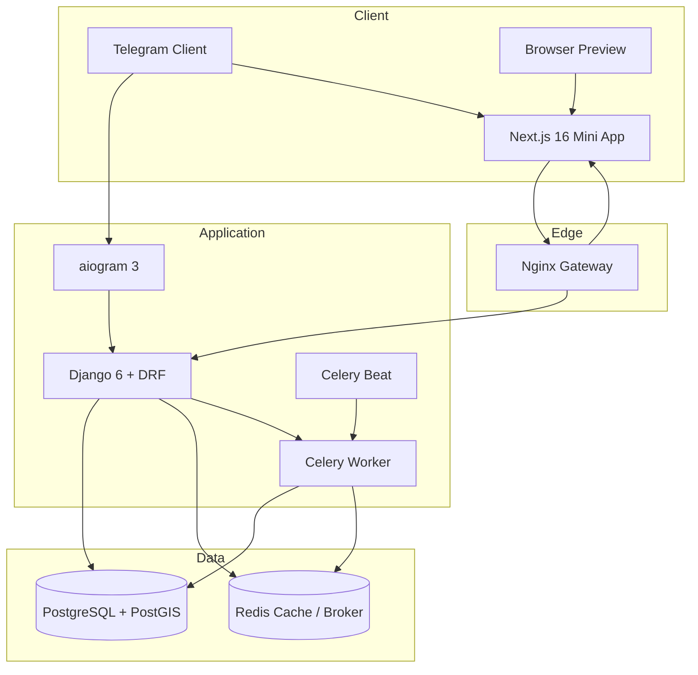
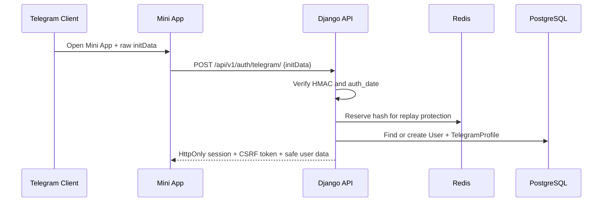

# Архітектура FlatHunter AI — Stage 1

## Принципи

- модульний monorepo без змішування frontend, bot і domain logic;
- Telegram є каналом ідентифікації, але backend залишається джерелом істини;
- усі важкі операції в майбутньому передаються в Celery;
- зовнішні джерела підключаються через незалежні legal-first adapters;
- core-функції не повинні залежати від доступності AI;
- polling і webhook ніколи не працюють одночасно.

## Компоненти

## Telegram Mini App authentication

## Backend module boundaries

- `apps.core`: logging, request IDs, errors and health checks;
- `apps.accounts`: users, roles, Telegram profiles and authentication;
- `apps.telegram_bot`: aiogram runtime, `/start`, webhook and polling command;
- future domain apps are added independently under `backend/apps/`.

## Deployment modes

### Local

- Next.js dev server;
- Django development server;
- optional SQLite/in-memory cache;
- bot long polling.

### Docker / production-oriented

- Nginx gateway;
- Gunicorn Django service;
- Next.js standalone runtime;
- PostgreSQL/PostGIS;
- Redis;
- Celery worker;
- exactly one Celery Beat;
- Telegram webhook over HTTPS.
