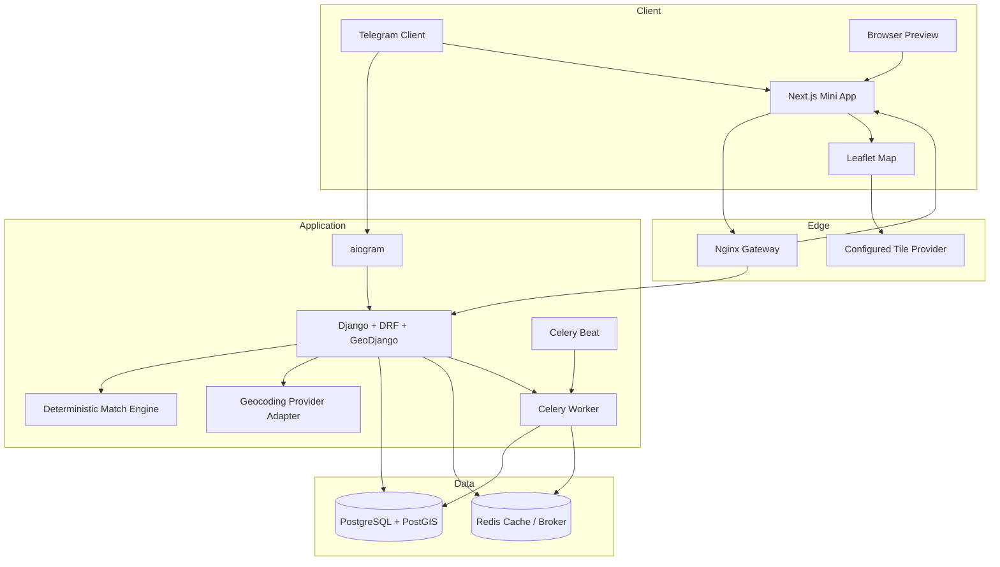
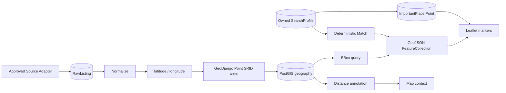
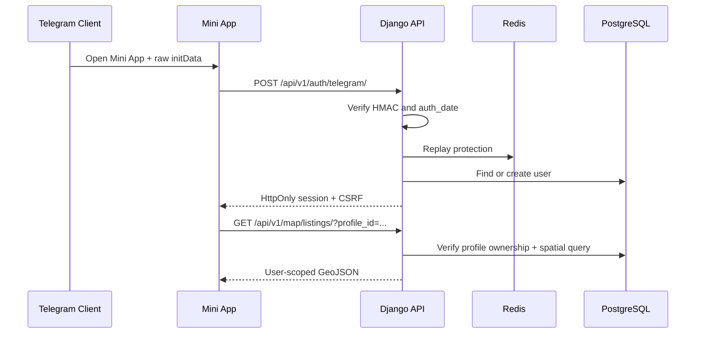

# Архітектура FlatHunter AI — Stage 6

## Принципи

- modular monorepo без змішування frontend, bot і domain logic;
- Telegram є каналом ідентифікації, backend залишається джерелом істини;
- core matching і demo geocoding не залежать від AI;
- зовнішні джерела та providers підключаються через legal-first adapters;
- персональні профілі, стани й геодані завжди user-scoped;
- external geocoding є opt-in і вимкнений за замовчуванням;
- PostGIS використовується для spatial filtering і distances;
- polling і webhook ніколи не працюють одночасно.

## Компоненти

## Backend modules

- `apps.core`: logging, request IDs, normalized errors і health checks;
- `apps.accounts`: users, roles, Telegram profiles й authentication;
- `apps.telegram_bot`: aiogram runtime, onboarding, webhook і polling;
- `apps.searches`: search profiles, notification preferences й important places;
- `apps.listings`: raw/normalized listings і personal listing state;
- `apps.matching`: deterministic Match Score;
- `apps.geodata`: geometry helpers, providers, spatial services, GeoJSON і map API.

## Geodata flow

## Coordinate model

`Listing` і `ImportantPlace` зберігають:

- decimal `latitude` / `longitude` для import/API compatibility;
- geography `location` для spatial operations.

Model helpers підтримують синхронізацію. Geometry використовує SRID 4326, а point order — longitude, latitude.

## Geocoding boundary

`apps.geodata.contracts.GeocodingProvider` визначає provider interface.

- `DemoGeocodingProvider`: deterministic, offline, CI-safe;
- `NominatimGeocodingProvider`: opt-in, fixed endpoint, UA-only, timeout, cache, rate slot.

API не приймає provider URL і не розкриває credentials.

## Authentication boundary

## Deployment modes

### Local development

- PostgreSQL/PostGIS is required from Stage 6;
- Redis may be local or containerized;
- Next.js dev server;
- Django development server;
- Telegram long polling;
- demo geocoder by default.

### Production-oriented

- Nginx gateway and HTTPS termination;
- Gunicorn Django service with GIS runtime libraries;
- Next.js standalone runtime;
- PostgreSQL/PostGIS;
- Redis;
- Celery worker;
- exactly one Celery Beat;
- Telegram webhook;
- provider policies, attribution, backups and monitoring configured before external integrations.
