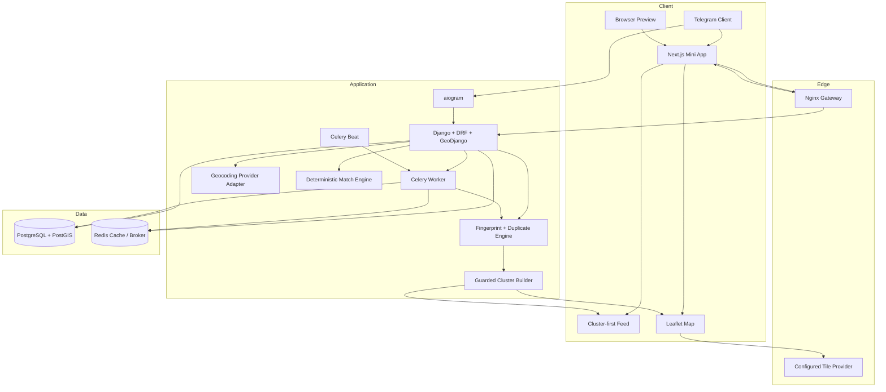
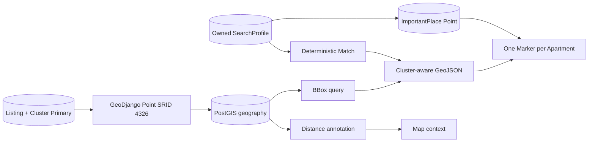
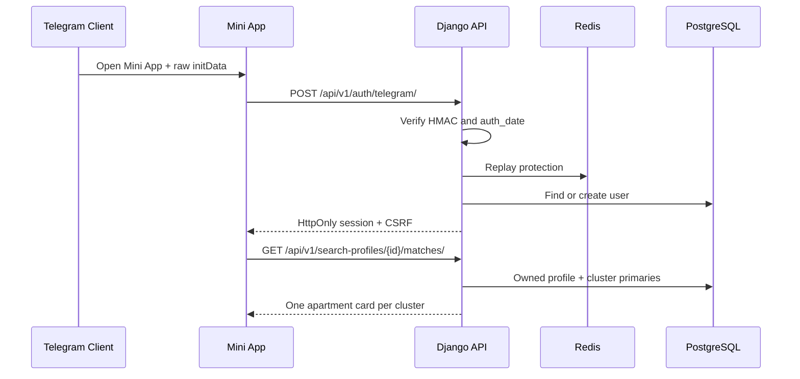

# Архітектура FlatHunter AI — Stage 7

## Принципи

- modular monorepo без змішування frontend, bot і domain logic;
- Telegram є каналом ідентифікації, backend залишається джерелом істини;
- core matching, duplicate detection і demo geocoding не залежать від AI;
- зовнішні джерела та providers підключаються через legal-first adapters;
- персональні профілі, стани й геодані завжди user-scoped;
- оригінальні `Listing` зберігаються навіть після об’єднання в кластер;
- external geocoding та queued duplicate refresh є opt-in;
- PostGIS використовується для spatial filtering і distances;
- polling і webhook ніколи не працюють одночасно.

## Компоненти

## Backend modules

- `apps.core`: logging, request IDs, normalized errors і health checks;
- `apps.accounts`: users, roles, Telegram profiles й authentication;
- `apps.telegram_bot`: aiogram runtime, onboarding, webhook і polling;
- `apps.searches`: search profiles, notification preferences й important places;
- `apps.listings`: raw/normalized listings і backward-compatible listing state;
- `apps.matching`: deterministic Match Score;
- `apps.duplicates`: normalized fingerprints, candidate scoring, manual decisions, guarded clusters, cluster user state and presentation helpers;
- `apps.geodata`: geometry helpers, providers, spatial services, GeoJSON і map API.

## Listing and duplicate flow

```mermaid
flowchart LR
    SOURCE[Approved Source Adapter] --> RAW[(RawListing)]
    RAW --> NORMALIZE[Normalize]
    NORMALIZE --> LISTING[(Listing)]
    LISTING --> FP[ListingFingerprint]
    FP --> BLOCKS[Bounded Candidate Blocks]
    BLOCKS --> SCORE[Explainable Duplicate Score]
    SCORE --> POLICY{Policy}
    POLICY -->|>= 92 / exact| MERGE[Accepted Edge]
    POLICY -->|78-91.99| REVIEW[Needs Review]
    POLICY -->|< 78 / conflict| REJECT[Rejected]
    REVIEW --> MANUAL[Confirm / Split / Restore]
    MANUAL --> MERGE
    MERGE --> GUARD[Transitive Poisoning Guard]
    GUARD --> CLUSTER[(ListingCluster)]
    CLUSTER --> PRIMARY[Deterministic Primary]
    PRIMARY --> FEED[One Card]
    PRIMARY --> MAP[One Marker]
    CLUSTER --> SOURCES[All Source Copies]
```

`Listing` remains the source-normalized record. `ListingClusterMember` is presentation grouping, not destructive merging.

## Duplicate boundaries

Candidate generation is bounded by canonical URL, hashed contacts, address, coordinate grid, stable attributes, trusted image hashes, or text SimHash blocks. It does not run unrestricted all-pairs comparisons.

The score combines exact evidence, address/geography, attributes, text, trusted image metadata, and price compatibility. Missing components are excluded and weights are renormalized.

Small clusters require a complete compatibility graph. Large clusters require compatibility with the primary and a strong global pair ratio. Manual split edges are authoritative.

## State projection

`UserClusterState` owns favorite, hidden, compared, and note for clustered apartments. Existing `UserListingState` remains valid for standalone listings and mirrors the current cluster primary for backward compatibility.

One cluster occupies one comparison slot. Default feeds, personalized matches, dashboard metrics, and map markers collapse duplicates to active primaries.

## Geodata flow

## Coordinate model

`Listing` і `ImportantPlace` зберігають decimal `latitude` / `longitude` для import/API compatibility та geography `location` для spatial operations. Geometry використовує SRID 4326, а point order — longitude, latitude.

## Geocoding boundary

`apps.geodata.contracts.GeocodingProvider` визначає provider interface.

- `DemoGeocodingProvider`: deterministic, offline, CI-safe;
- `NominatimGeocodingProvider`: opt-in, fixed endpoint, UA-only, timeout, cache, rate slot.

API не приймає provider URL і не розкриває credentials.

## Authentication boundary

## Deployment modes

### Local development

- PostgreSQL/PostGIS is required;
- Redis may be local or containerized;
- Next.js dev server;
- Django development server;
- Telegram long polling;
- demo geocoder and offline demo duplicate hashes by default;
- duplicate queue disabled by default.

### Production-oriented

- Nginx gateway and HTTPS termination;
- Gunicorn Django service with GIS runtime libraries;
- Next.js standalone runtime;
- PostgreSQL/PostGIS;
- Redis;
- Celery worker with optional dedicated `duplicates` queue;
- exactly one Celery Beat;
- Telegram webhook;
- source policies, image allowlists, backups, thresholds and monitoring configured before enabling automatic duplicate refresh.
