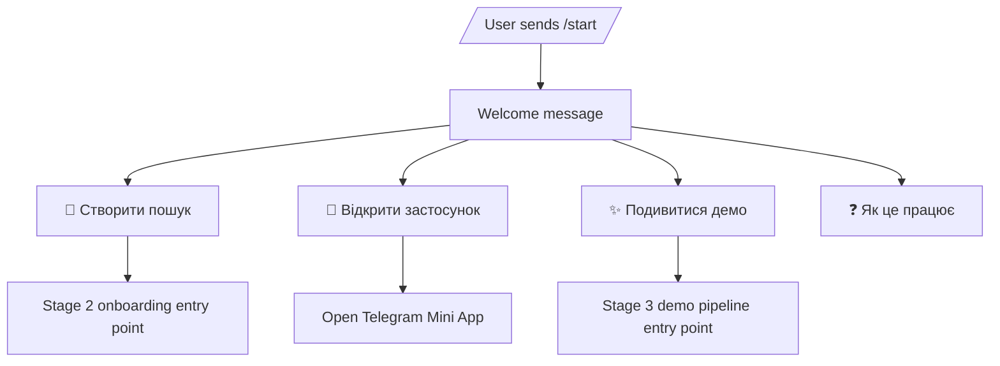

# Telegram bot flows — Stage 1

## `/start`

The Stage 1 bot already exposes the correct entry points. Search onboarding and demo data are deliberately not faked before their dedicated stages.

## Runtime modes

- `TELEGRAM_MODE=polling`: run `python manage.py runbot` locally;
- `TELEGRAM_MODE=webhook`: Telegram sends updates to `/api/v1/telegram/webhook/`;
- the management command rejects non-polling mode;
- the polling Docker service is behind the `polling` profile and is disabled in production overrides.
