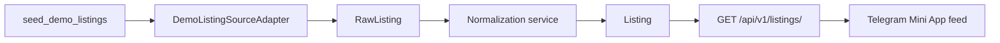

# Stage 3 — Demo data pipeline

Stage 3 adds a legal-first synthetic listing pipeline. It does not call third-party housing websites.

## Flow



## Domain models

- `ListingSource` stores access mode, legal state, feature support and health.
- `RawListing` stores the original synthetic payload with a SHA-256 payload hash and retention timestamp.
- `Listing` stores normalized fields used by search, matching and the Mini App.

Raw data and normalized data are intentionally separated. The pipeline is idempotent: ingesting the same deterministic dataset again does not create duplicate records.

## Seed data

```bash
cd backend
uv run --no-sync python manage.py migrate
uv run --no-sync python manage.py seed_demo_listings
```

Optional parameters:

```bash
uv run --no-sync python manage.py seed_demo_listings --count 150 --seed 20260716
```

The default command creates 150 synthetic listings distributed across Львів, Рівне and Київ. Every listing is clearly marked as demo data and does not describe a real property.

## Listing API

```text
GET /api/v1/listings/
GET /api/v1/listings/{id}/
```

Supported query parameters:

- `city`;
- `rooms`;
- `price_min`;
- `price_max`;
- `district`;
- `search`;
- `ordering` with `published_at`, `price_uah`, `rooms`, `total_area`.

The endpoint is authenticated and read-only.

## Source policy

Before ingestion the adapter health check must pass. An existing source is rejected when it is disabled or does not have an approved legal status. Future real adapters must use the same interface and policy gate.

No CAPTCHA bypass, private API access, proxy rotation, hidden contact collection or other anti-abuse circumvention is implemented.
