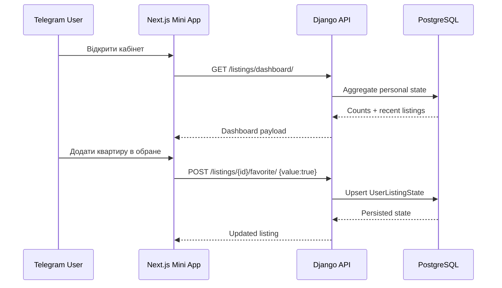

# Етап 5 — Mini App UI

## Мета

Перетворити технічну стрічку з етапу 4 на повноцінний мобільний кабінет користувача всередині Telegram Mini App.

## Реалізовані екрани

1. **Dashboard** — активні пошуки, доступні оголошення, обране, приховані й порівнювані квартири.
2. **Персональна стрічка** — Match Score, вибір профілю, мінімальна оцінка та сортування.
3. **Деталі оголошення** — ціна, характеристики, опис, фото, джерело й персональні дії.
4. **Обране** — окрема user-scoped видача з фільтрами міста та району.
5. **Порівняння** — таблиця до чотирьох квартир з однаковим набором параметрів.

## Модель стану

`UserListingState` зберігає окремо для кожного користувача:

- `is_favorite`;
- `is_hidden`;
- `is_compared`;
- `note` для майбутнього розширення;
- timestamps.

Unique constraint `(user, listing)` не допускає дублікати стану. Дані не зберігаються лише у браузері й не втрачаються після перезапуску Mini App.

## API

```text
GET  /api/v1/listings/dashboard/
GET  /api/v1/listings/{id}/
POST /api/v1/listings/{id}/favorite/
POST /api/v1/listings/{id}/hide/
POST /api/v1/listings/{id}/compare/
```

Усі state endpoints приймають:

```json
{"value": true}
```

Операція є ідемпотентною: клієнт передає бажаний стан, а не команду `toggle`.

## Security boundaries

- Усі endpoints вимагають автентифіковану session.
- Стан завжди фільтрується за `request.user`.
- Користувач не може прочитати або змінити favorite/hidden/compared іншого користувача.
- Приховане оголошення зникає зі стрічки, але доступне власнику напряму, щоб його можна було відновити.
- Вимкнені або юридично не схвалені джерела не потрапляють у UI.
- Порівняння обмежене чотирма оголошеннями та захищене транзакцією.

## UX states

Mini App обробляє:

- loading;
- empty dashboard/feed/favorites/comparison;
- Telegram authentication error;
- backend validation error;
- comparison limit;
- abort при зміні вкладки або закритті компонента;
- responsive layout і Telegram safe-area.

## Data flow



## Перевірка

Backend-тести покривають:

- persistence обраного;
- ізоляцію між користувачами;
- приховування й відновлення;
- ліміт порівняння;
- dashboard counts;
- валідацію state payload.

Повний quality gate: Ruff, mypy, migrations, pytest, pip-audit, ESLint, TypeScript, frontend tests/build, npm audit, Docker builds і Gitleaks.
