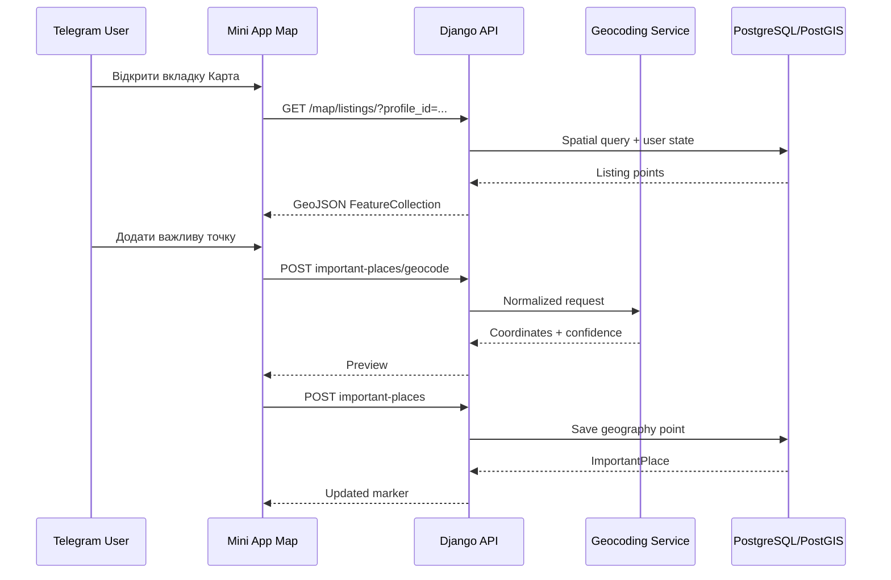

# Етап 6 — Карта та геодані

## Що реалізовано

Етап 6 додає повноцінний геопросторовий шар:

- GeoDjango;
- PostgreSQL + PostGIS;
- `PointField(srid=4326, geography=True)` для квартир і важливих місць;
- deterministic coordinates для synthetic dataset;
- GeoJSON API;
- bounding-box filtering;
- straight-line distance через PostGIS geography;
- deterministic demo geocoder;
- опційний Nominatim provider;
- Leaflet-карта в Telegram Mini App;
- маркери квартир і важливих точок;
- додавання точки за адресою або кліком;
- синхронізація marker, listing details, favorite і comparison.

## Потік даних



## Геометрія

Координати зберігаються у двох формах:

- `latitude` і `longitude` — сумісність API та імпорту;
- `location` — PostGIS geography point для spatial queries.

Порядок GeoJSON і PostGIS point: **longitude, latitude**.

Моделі синхронізують decimal coordinates і geometry перед збереженням. Міграції також backfill-ять точки для існуючих записів.

## Geocoding providers

### Demo provider

Значення за замовчуванням:

```env
GEOCODING_PROVIDER=demo
GEOCODING_EXTERNAL_ENABLED=false
```

Demo provider:

- не звертається в інтернет;
- підтримує Львів, Рівне та Київ;
- повертає deterministic coordinates;
- підходить для CI, локального demo та портфоліо;
- не стверджує, що координати відповідають реальному об'єкту.

### Nominatim

Для opt-in режиму:

```env
GEOCODING_PROVIDER=nominatim
GEOCODING_EXTERNAL_ENABLED=true
GEOCODING_USER_AGENT=FlatHunterAI/1.0 (contact: admin@example.com)
GEOCODING_TIMEOUT_SECONDS=8
GEOCODING_CACHE_SECONDS=2592000
```

Захисти:

- fixed official endpoint у backend-коді;
- клієнт не передає provider URL;
- UA-only country filter;
- timeout;
- normalized cache key;
- Redis rate slot;
- стабільні domain errors;
- жодного API key у frontend.

Перед production потрібно перевірити актуальну usage policy провайдера та встановити справжній контактний User-Agent.

## Map API

### Квартири

```http
GET /api/v1/map/listings/?profile_id=<uuid>&bbox=west,south,east,north&min_score=70&limit=300
```

Відповідь:

```json
{
  "type": "FeatureCollection",
  "features": [
    {
      "type": "Feature",
      "id": "...",
      "geometry": {
        "type": "Point",
        "coordinates": [24.0297, 49.8397]
      },
      "properties": {
        "id": "...",
        "title": "2-кімнатна квартира",
        "price_uah": 18000,
        "city": "Львів",
        "match": { "score": 86 }
      }
    }
  ],
  "meta": {
    "returned": 1,
    "inspected": 1,
    "profile_id": "...",
    "tiles_url": "...",
    "attribution": "..."
  }
}
```

`bbox` має формат `west,south,east,north`. Неправильний порядок або координати поза допустимим діапазоном повертають `400`.

### Важливі точки

```http
GET    /api/v1/search-profiles/{profile_id}/important-places/
POST   /api/v1/search-profiles/{profile_id}/important-places/
POST   /api/v1/search-profiles/{profile_id}/important-places/geocode/
DELETE /api/v1/search-profiles/{profile_id}/important-places/{place_id}/
```

Створення за адресою:

```json
{
  "name": "Офіс",
  "address": "вул. Наукова 7",
  "max_distance_km": 5,
  "importance": 5
}
```

Створення кліком на карту:

```json
{
  "name": "Університет",
  "address": "Точка з карти",
  "latitude": 49.835,
  "longitude": 24.014,
  "max_distance_km": 3,
  "importance": 4
}
```

### Distance context

```http
GET /api/v1/search-profiles/{profile_id}/map-context/?listing_ids=<uuid>,<uuid>
```

Повертає distance у кілометрах від кожної видимої квартири до owned important places.

## Mini App UX

Вкладка `Карта` містить:

- selector активного профілю;
- Match threshold;
- фільтр «лише обране»;
- apartment markers;
- important-place markers;
- marker tooltip;
- mobile listing sheet;
- straight-line distance context;
- address preview;
- map-click draft point;
- видалення important place з rollback при API error;
- Telegram safe-area і touch-friendly controls.

Tile attribution завжди відображається через Leaflet attribution control.

## Команди

```bash
docker compose exec backend python manage.py migrate
docker compose exec backend python manage.py seed_demo_listings
docker compose exec backend python manage.py geocode_demo_data
```

`geocode_demo_data` безпечно запускати повторно. Команда звітує `processed`, `updated`, `unchanged`, `failed`.

## Безпека

- усі endpoints вимагають authenticated session;
- profile ownership перевіряється на backend;
- чужий profile повертає `404`;
- довільний external URL не приймається;
- external provider вимкнений за замовчуванням;
- geocoding response не містить secret configuration;
- hidden listings не потрапляють на карту;
- disabled або legally unapproved sources не потрапляють у GeoJSON.

## Відомі обмеження

Distance — геодезична відстань по прямій. Це не walking, driving або transit time. Routing та isochrones потребують окремого provider adapter і не входять до етапу 6.
